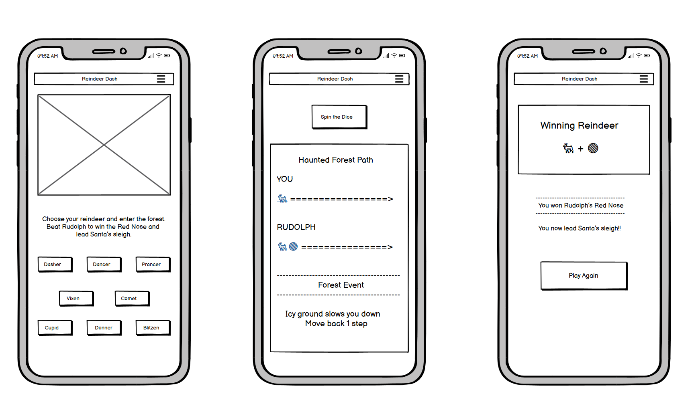

# Placeholder: Link to Live Game

# Red-Nose Rebels

## Welcome to Red-Nose Rebels, your rebellious Christmas challenge!

Placeholder: Mock-up from Am-I-Responsive

Red-Nose Rebels is a classic board game in which Father Christmas’s reindeer have grown tired of Rudolph’s prominent role during the annual festive season. Players choose one of Father Christmas’s reindeer — Dasher, Dancer, Prancer, Vixen, Comet, Cupid, Donner, or Blitzen — to challenge Rudolph in a race to the finish line.

The winning reindeer not only earns the coveted pole position in the annual race to deliver presents on time, but also gets to wear Rudolph’s famous red nose (hence the name *Red-Nose Rebels*). While the game follows a straightforward and accessible set of rules, it encourages strategic thinking and creativity within a festive setting.

So, join us on the track and compete to claim the most famous red nose in history. After all, rolling the dice has never been more fun!

---

## Purpose, Goals and User Information

### Purpose

*Red-Nose Rebels* is a festive, browser-based board game designed to provide an engaging and accessible gaming experience inspired by traditional dice-based race games. The project combines playful storytelling with interactive gameplay, focusing on usability, visual appeal, and responsiveness across devices. It also serves as a technical demonstration of our front-end development skills within a creative, seasonal context.

### Primary Goals

- Create a fun and intuitive dice-based game that can be easily understood and played by a wide audience.  
- Deliver a visually engaging experience through animations, sound effects, and themed design elements.  
- Implement clear game logic that allows a human player to compete against a computer-controlled opponent.  
- Ensure the game is fully responsive and playable on mobile, tablet, and desktop devices.

### Secondary Goals

- Demonstrate technical competence in HTML, CSS, and JavaScript through interactive elements, animations, and game logic.  
- Apply modern front-end practices, including structured assets, reusable components, and clean code organisation.  
- Explore user experience design principles such as feedback, accessibility, and intuitive interaction.  
- Lay groundwork for future expansion, such as additional players, game modes, or enhanced visual effects.

### Target Users

The game is intended for casual players of all ages who enjoy simple, luck-based games with a festive theme. It is particularly suitable for users looking for a short, entertaining experience that does not require prior gaming knowledge or complex instructions.

---

## User Stories

- As a user, we want the game to have a consistent visual identity so it feels polished and cohesive.  
- As a user, we want to control sound and animations (on/off) so we can play comfortably depending on our device and preference.  
- As a user, we want to open a close-up view of the dice result so we can clearly see what we rolled.  
- As a user, we want to click a Roll button and see a dice animation so the game feels interactive, and then see the rolled result displayed clearly.  
- As a user, we want the game to look dark and festive but remain easy to read so we can enjoy playing it.  
- As a user, we want to clearly see when the game is finished so we know who won.  
- As a user, we want random events to affect movement so each game feels different.  
- As a user, we want to play against Rudolph so there is a clear rival in the game.  
- As a user, we want our reindeer to move step by step across the board so we can track our progress.

---

## Design

### Visual Design

The main design goal was to base the game on an unconventional festive theme. Spooky trees appear in the background, through which the racing reindeer must travel. While the game is inspired by Tim Burton’s *The Nightmare Before Christmas*, it does not replicate its Halloween-inspired aesthetic. Instead, the game pays homage both to traditional festive imagery and to the darker undercurrents that often accompany such cultural events.

Finally, *Red-Nose Rebels* aims to appeal to players who question received wisdom and tradition by challenging Rudolph’s prominent position as *pars pro toto* for all rebellious spirits who embrace the festive season without uncritically accepting the status quo.

### Audio Management

We used sound to make playing more fun. We organized all the audio files and ensured they work smoothly across the project.

- **How sounds are loaded:** When the game starts, all sounds (dice rolling, winning, losing, and the bell when you pick a reindeer) are loaded from the `assets/audio` folder. Each sound is set up once and stored in memory so it can be played quickly when needed.  
- **How sounds are played and reused:** Instead of creating new sound objects every time, the same objects are reused. When you roll the dice, the dice sound plays. When you hover over a reindeer, a bell sound plays. After each sound finishes, it stops and resets so it can play again the next time.  
- **Stopping sounds:** If another event happens, all sounds stop at once to prevent overlapping. For example, if you click a button while the dice sound is playing, the old sound stops immediately.  
- **Better game experience:** Sound provides instant feedback — a bell when picking a reindeer, a rolling noise when the dice rolls, and cheering when you win.  
- **User control:** Players can turn sound on and off with the audio button at the top. The site remembers the preference on return.  
- **Browser protection:** Modern browsers block auto-playing sounds, so players need to click once on the page to unlock audio. After that, sounds play as intended.

### Bootstrap Utilisation and Animations

We used Bootstrap and CSS animations to create a clean, modern look and make the site feel responsive on all devices.

- **Bootstrap for layout and responsiveness:** Buttons use Bootstrap classes for consistent styling. The grid system ensures the layout looks good on phones, tablets, and computers. Containers and spacing (padding, margin, gap) keep things organized. Elements like modals and responsive menus are built-in.  
- **Simple animations:**  
  - Button hover effects: Moves slightly and casts a shadow.  
  - Dice spinning: Spins smoothly when rolling.  
  - Snow falling: Appears on win and lose screens.  
  - Winner celebrations: Reindeer bounces; arrow guides eye; red nose blinks.  
  - Victory animations: Winning reindeer pulses and bounces.  
All animations use CSS transitions and keyframes and run smoothly without slowing the game.

### Reindeer Cards and Game Screen

- **Reindeer cards:** Each card is a button with an image, name, and styling. We added custom colors and effects. Each button holds a `data-reindeer` attribute so the game knows which reindeer was chosen. Hovering enlarges and rotates the image, and the card changes from white to a purple gradient. Clicking keeps it highlighted.  
- **Game screen organization:**  
  - **Top area:** Shows the chosen reindeer and the "Spin the Dice" button.  
  - **Racing tracks:** Two horizontal tracks (player and Rudolph) with tokens moving step by step.  
  - **Dice section:** Dice image spins when rolled.  
  - **Event area:** Displays messages after each roll (slipping, shortcuts).  
  - Background: Light gradient with subtle glass-morphism effect. Centered and responsive layout.

- **Token movement:** Player and Rudolph tokens are moved by adding position classes in JavaScript, creating smooth animations and clean code.

---

## Wireframes

Before development began, we used wireframes to plan the entire project. They illustrate:

- Start screen (choose reindeer)  
- Game screen (roll dice and race)  
- Win screen (player reaches finish)  
- Lose screen (Rudolph wins)  

Wireframes guided layout, spacing, button placement, and screen flow. The project was designed mobile-first to ensure accessibility on phones, tablets, and computers.

## Game Features

### Placeholder screenshots of game features: background, reindeer, dice and counters etc.

## Future Features and Extensions

### Gameplay Enhancements
- **Multiple Player Mode:** Allow two or more human players to compete on the same track or via online multiplayer.  
- **Customizable Reindeer:** Let players choose or unlock new reindeer characters with unique appearances or abilities.  
- **Power-Ups and Hazards:** Add special tiles, bonuses, or obstacles on the track to make gameplay more strategic.  
- **Alternative Dice Mechanics:** Introduce dice with special effects (e.g., double rolls, freeze turns) or custom dice faces.  
- **Level-based Challenges:** Different tracks or boards with increasing difficulty or unique thematic elements.  

### Visual and Audio Improvements
- **Enhanced Animations:** More dynamic dice rolls, reindeer movements, and celebratory effects for wins or losses.  
- **Thematic Environments:** Seasonal variations (snow, night mode, different festive landscapes).  
- **Customizable Music & Sounds:** Let users pick background music or sound themes for a personalized experience.  
- **Particle Effects:** Sparkles, snow, or confetti when events occur (rolling dice, winning, etc.).  

### User Experience & Accessibility
- **Tutorial Mode:** An interactive guide for new players explaining rules and controls.  
- **Adaptive Difficulty:** Adjust the computer’s AI for beginners, intermediate, or expert players.  
- **Accessibility Options:** High-contrast mode, screen reader support, and keyboard-only controls.  
- **Saved Progress & Leaderboards:** Track player statistics, high scores, and achievements over multiple sessions.  

### Technical Improvements
- **Mobile App Version:** Port the game to iOS or Android for a native mobile experience.  
- **Progressive Web App (PWA):** Allow offline play and installation as a standalone app.  
- **Code Refactoring:** Modularize JavaScript for maintainability and add automated testing.  
- **Database Integration:** Store player profiles, scores, and customization options in a backend.  

### Community & Engagement Features
- **Reindeer Unlockables:** Unlock new characters, skins, or accessories for milestones or achievements.  
- **Seasonal Events:** Limited-time boards, dice, or challenges tied to holidays.  
- **Custom Challenges:** Users can create and share their own tracks or game scenarios.  
- **Social Sharing:** Share results, victories, or funny moments on social media.  

## Tools and Technologies

For this project, we used the following tools and technologies:

- **HTML** – for structuring the game and creating interactive elements.  
- **CSS** – for styling, layout, and animations.  
- **JavaScript** – for implementing game logic, dice rolls, and token movement.  
- **GitHub** – for version control and collaboration.  
- **Balsamiq** – for wireframing and planning the user interface.  
- **VS Code** – as our primary code editor for development.  

## Bug Documentation

### Placeholder for documented bugs.

## Deployment

### GitHub Pages

The site was deployed to GitHub Pages. The steps to deploy are as follows:

* In the **GitHub repository**, navigate to the "Settings" tab.
* In Settings, click on the "Pages" link from the menu on the left.
* From the "Build and deployment" section, click the drop-down called "Branch", and select the main branch, then click "Save".
* The page will be automatically refreshed with a detailed message display to indicate the successful deployment.
* Allow up to 5 minutes for the site to fully deploy.

The live link can be found on **GitHub Pages**.

### Local Development

This project can be cloned or forked in order to make a local copy on your own system.

#### Cloning

You can clone the repository by following these steps:

1. Go to the **GitHub repository**.
2. Locate and click on the green "Code" button at the very top, above the commits and files.
3. Select whether you prefer to clone using "HTTPS", "SSH", or "GitHub CLI", and click the "copy" button to copy the URL to your clipboard.
4. Open "Git Bash" or "Terminal".
5. Change the current working directory to the location where you want the cloned directory.
6. In your IDE Terminal, type the following command to clone the repository:
   * `git clone https://github.com/[YOUR-USERNAME]/red-nose-rebels.git`
7. Press "Enter" to create your local clone.

To run locally:

1. Open the `index.html` file in your browser, or
2. Use a local development server such as Live Server in VS Code

#### Forking

By forking the GitHub Repository, you make a copy of the original repository on your GitHub account to view and/or make changes without affecting the original owner's repository. You can fork this repository by using the following steps:

1. Log in to GitHub and locate the **GitHub Repository**.
2. At the top of the Repository, just below the "Settings" button on the menu, locate and click the "Fork" Button.
3. Once clicked, you should now have a copy of the original repository in your own GitHub account!

